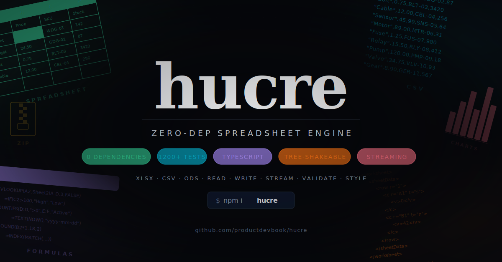

<p align="center">
  <br>
  
  <br><br>
  <b style="font-size: 2em;">hucre</b>
  <br><br>
  Zero-dependency spreadsheet engine.
  <br>
  Read & write XLSX, CSV, ODS, JSON, NDJSON, XML. Schema validation, streaming, round-trip preservation. Pure TypeScript, works everywhere.
  <br><br>
  <a href="https://npmjs.com/package/hucre"></a>
  <a href="https://npmjs.com/package/hucre"></a>
  <a href="https://bundlephobia.com/result?p=hucre"></a>
  <a href="https://github.com/productdevbook/hucre/blob/main/LICENSE"></a>
</p>

## Quick Start

```sh
npm install hucre
```

```ts
import { readXlsx, writeXlsx } from "hucre";

// Read an XLSX file
const workbook = await readXlsx(buffer);
console.log(workbook.sheets[0].rows);

// Write an XLSX file
const xlsx = await writeXlsx({
  sheets: [
    {
      name: "Products",
      columns: [
        { header: "Name", key: "name", width: 25 },
        { header: "Price", key: "price", width: 12, numFmt: "$#,##0.00" },
        { header: "Stock", key: "stock", width: 10 },
      ],
      data: [
        { name: "Widget", price: 9.99, stock: 142 },
        { name: "Gadget", price: 24.5, stock: 87 },
      ],
    },
  ],
});
```

## Tree Shaking

Import only what you need:

```ts
import { readXlsx, writeXlsx } from "hucre/xlsx"; // XLSX only
import { parseCsv, writeCsv } from "hucre/csv"; // CSV only (~2 KB gzipped)
import { readOds, writeOds } from "hucre/ods"; // ODS only
import { parseJson, writeNdjson } from "hucre/json"; // JSON / NDJSON
import { readXml, writeXml } from "hucre/xml"; // Tabular XML
```

## Why hucre?

### vs JavaScript / TypeScript Libraries

|                         | hucre     | SheetJS CE    | ExcelJS   | xlsx-js-style |
| ----------------------- | --------- | ------------- | --------- | ------------- |
| **Dependencies**        | 0         | 0\*           | 12 (CVEs) | 0\*           |
| **Bundle (gzip)**       | ~18 KB    | ~300 KB       | ~500 KB   | ~300 KB       |
| **ESM native**          | Yes       | Partial       | No (CJS)  | Partial       |
| **TypeScript**          | Native    | Bolted-on     | Bolted-on | Bolted-on     |
| **Edge runtime**        | Yes       | No            | No        | No            |
| **CSP compliant**       | Yes       | Yes           | No (eval) | Yes           |
| **npm published**       | Yes       | No (CDN only) | Stale     | Yes           |
| **Read + Write**        | Yes       | Yes (Pro $)   | Yes       | Yes           |
| **Styling**             | Yes       | No (Pro $)    | Yes       | Yes           |
| **Cond. formatting**    | Yes (all) | No (Pro $)    | Partial   | No            |
| **Stream read + write** | Yes       | CSV only      | Yes       | CSV only      |
| **ODS support**         | Yes       | Yes           | No        | Yes           |
| **Round-trip**          | Yes       | Partial       | Partial   | Partial       |
| **Sparklines**          | Yes       | No            | No        | No            |
| **Tables**              | Yes       | Yes           | Yes       | Yes           |
| **Images**              | Yes       | No (Pro $)    | Yes       | No            |

\* SheetJS removed itself from npm; must install from CDN tarball.

### vs Libraries in Other Languages

|                       | hucre (TS)   | openpyxl (Py) | XlsxWriter (Py) | rust_xlsxwriter | Apache POI (Java) |
| --------------------- | ------------ | ------------- | --------------- | --------------- | ----------------- |
| **Read XLSX**         | Yes          | Yes           | No              | No              | Yes               |
| **Write XLSX**        | Yes          | Yes           | Yes             | Yes             | Yes               |
| **Streaming**         | Read+Write   | Write-only    | No              | const_memory    | SXSSF (write)     |
| **Charts**            | Round-trip   | 15+ types     | 9 types         | 12+ types       | Limited           |
| **Pivot tables**      | Read + Write | Read-only     | No              | No              | Limited           |
| **Cond. formatting**  | Yes (all)    | Yes           | Yes             | Yes             | Yes               |
| **Sparklines**        | Yes          | No            | Yes             | Yes             | No                |
| **Formula eval**      | No           | No            | No              | No              | Yes               |
| **Multi-format**      | XLSX/ODS/CSV | XLSX only     | XLSX only       | XLSX only       | XLS/XLSX          |
| **Zero dependencies** | Yes          | lxml optional | No              | Yes             | No                |

## Features

### Reading

```ts
import { readXlsx } from "hucre/xlsx";

const wb = await readXlsx(uint8Array, {
  sheets: [0, "Products"], // Filter sheets by index or name
  readStyles: true, // Parse cell styles
  dateSystem: "auto", // Auto-detect 1900/1904
});

for (const sheet of wb.sheets) {
  console.log(sheet.name); // "Products"
  console.log(sheet.rows); // CellValue[][]
  console.log(sheet.merges); // MergeRange[]
}
```

`sheets` also accepts a predicate that runs against lightweight metadata
**before** each worksheet body is parsed — useful for visibility-based
selection without paying the I/O cost of the full read:

```ts
const wb = await readXlsx(buf, {
  sheets: (info) => !info.hidden && !info.veryHidden,
});
// info: { name, index, hidden?, veryHidden? }
```

Supported cell types: strings, numbers, booleans, dates, formulas, rich text, errors, inline strings.

### Writing

```ts
import { writeXlsx } from "hucre/xlsx";

const buffer = await writeXlsx({
  sheets: [
    {
      name: "Report",
      columns: [
        { header: "Date", key: "date", width: 15, numFmt: "yyyy-mm-dd" },
        { header: "Revenue", key: "revenue", width: 15, numFmt: "$#,##0.00" },
        { header: "Active", key: "active", width: 10 },
      ],
      data: [
        { date: new Date("2026-01-15"), revenue: 12500, active: true },
        { date: new Date("2026-01-16"), revenue: 8900, active: false },
      ],
      freezePane: { rows: 1 },
      autoFilter: { range: "A1:C3" },
    },
  ],
  defaultFont: { name: "Calibri", size: 11 },
});
```

Features: cell styles, auto column widths, merged cells, freeze/split panes, auto-filter with criteria, data validation, hyperlinks, images (PNG/JPEG/GIF/SVG/WebP), comments, tables, conditional formatting (cellIs/colorScale/dataBar/iconSet), named ranges, print settings, page breaks, sheet protection, workbook protection, rich text, shared/array/dynamic formulas, sparklines, textboxes, background images, number formats, hidden sheets, Excel 2024 native checkboxes, HTML/Markdown/JSON/TSV export, template engine.

### Auto Column Width

```ts
const buffer = await writeXlsx({
  sheets: [
    {
      name: "Products",
      columns: [
        { header: "Name", key: "name", autoWidth: true },
        { header: "Price", key: "price", autoWidth: true, numFmt: "$#,##0.00" },
        { header: "SKU", key: "sku", autoWidth: true },
      ],
      data: products,
    },
  ],
});
```

Calculates optimal column widths from cell content — font-aware, handles CJK double-width characters, number formats, min/max constraints.

### Data Validation

```ts
const buffer = await writeXlsx({
  sheets: [
    {
      name: "Sheet1",
      rows: [
        ["Status", "Quantity"],
        ["active", 10],
      ],
      dataValidations: [
        {
          type: "list",
          values: ["active", "inactive", "draft"],
          range: "A2:A100",
          showErrorMessage: true,
          errorTitle: "Invalid",
          errorMessage: "Pick from the list",
        },
        {
          type: "whole",
          operator: "between",
          formula1: "0",
          formula2: "1000",
          range: "B2:B100",
        },
      ],
    },
  ],
});
```

### Hyperlinks

```ts
const buffer = await writeXlsx({
  sheets: [
    {
      name: "Links",
      rows: [["Visit Google", "Go to Sheet2"]],
      cells: new Map([
        [
          "0,0",
          {
            value: "Visit Google",
            type: "string",
            hyperlink: { target: "https://google.com", tooltip: "Open Google" },
          },
        ],
        [
          "0,1",
          {
            value: "Go to Sheet2",
            type: "string",
            hyperlink: { target: "", location: "Sheet2!A1" },
          },
        ],
      ]),
    },
  ],
});
```

### Streaming

Process large files row-by-row without loading everything into memory:

```ts
import { streamXlsxRows, XlsxStreamWriter } from "hucre/xlsx";

// Stream read — async generator yields rows one at a time
for await (const row of streamXlsxRows(buffer)) {
  console.log(row.index, row.values);
}

// Cap the number of rows yielded (preview / sampling). The underlying
// ZIP/SAX stream is cancelled once the cap is reached, so very large
// sheets stay cheap.
for await (const row of streamXlsxRows(buffer, { maxRows: 100 })) {
  console.log(row.index, row.values);
}

// Filter to an A1 range. Rows outside the row span are skipped; cells
// outside the column span are masked to `null` (column indexes stay
// stable). Parsing stops once a row past the end-row is observed.
for await (const row of streamXlsxRows(buffer, { range: "B2:D1000" })) {
  // row.values[0] === null (column A is outside)
  // row.values[1..3] carry B/C/D
}

// Stream write — add rows incrementally
const writer = new XlsxStreamWriter({
  name: "BigData",
  columns: [{ header: "ID" }, { header: "Value" }],
  freezePane: { rows: 1 },
});
for (let i = 0; i < 100_000; i++) {
  writer.addRow([i + 1, Math.random()]);
}
const buffer = await writer.finish();
```

#### Auto-split past Excel's row limit

Pass `maxRowsPerSheet` to spill into `{name}_2`, `{name}_3`, … when the
data crosses Excel's 1,048,576-row hard limit (default). The captured
header row is repeated on every rolled sheet.

```ts
import { XlsxStreamWriter, XLSX_MAX_ROWS_PER_SHEET } from "hucre/xlsx";

const writer = new XlsxStreamWriter({
  name: "BigData",
  columns: [
    { key: "id", header: "ID" },
    { key: "v", header: "Value" },
  ],
  maxRowsPerSheet: 1_000_000, // optional override; default = 1_048_576
  repeatHeaders: true, // default
});

for (let i = 0; i < 3_000_000; i++) writer.addRow([i + 1, Math.random()]);
// → BigData, BigData_2, BigData_3
const buf = await writer.finish();
```

### ODS (OpenDocument)

```ts
import { readOds, writeOds } from "hucre/ods";

const wb = await readOds(buffer);
const ods = await writeOds({ sheets: [{ name: "Sheet1", rows: [["Hello", 42]] }] });
```

### Round-trip Preservation

Open, modify, save — without losing charts, macros, or features hucre doesn't natively handle:

```ts
import { openXlsx, saveXlsx } from "hucre/xlsx";

const workbook = await openXlsx(buffer);
workbook.sheets[0].rows[0][0] = "Updated!";
const output = await saveXlsx(workbook); // Charts, VBA, themes preserved
```

### External Workbook References

`[N]Sheet!Ref` references to other workbooks are read into a typed
`workbook.externalLinks` model and re-declared on roundtrip — without
this the `<externalReferences>` block and the matching relationship
disappear from `xl/workbook.xml.rels`, leaving Excel with orphan
`externalLinkN.xml` parts that it ignores.

```ts
import { readXlsx, parseExternalLink } from "hucre";

const wb = await readXlsx(buf);
for (const link of wb.externalLinks ?? []) {
  console.log(link.target, link.targetMode, link.sheetNames);
  for (const sheet of link.sheetData) {
    for (const cell of sheet.cells) {
      // cell.type ∈ "n" | "s" | "b" | "e" | "str"
      console.log(cell.ref, cell.type, cell.value);
    }
  }
}

// Standalone parser when you already have the XML strings
const link = parseExternalLink(externalLinkXml, externalLinkRelsXml);
```

The 1-based index in `workbook.externalLinks` matches the `[N]` prefix
used by formulas like `[1]Sheet1!A1`. Cached `t="s"` values stay as
shared-string indices into the _external_ workbook (which hucre cannot
dereference); resolved strings live in the linked file.

### Cell-Embedded Images (WPS DISPIMG)

WPS Office (and recent Excel versions) embed images inside cells via a
workbook-level `xl/cellimages.xml` registry referenced from
`=_xlfn.DISPIMG("<id>", 1)` formulas. hucre reads the registry into a
typed `workbook.cellImages` array and re-declares the part on
`saveXlsx` so the DISPIMG link survives round-trips — without this the
relationship and content-type override are dropped and the formula
loses its target.

```ts
import { readXlsx } from "hucre";

const wb = await readXlsx(buf);
for (const img of wb.cellImages ?? []) {
  console.log(img.id, img.type, img.description, img.data.byteLength);
}

// Standalone parsers when you already have the XML strings.
import { parseCellImages, assembleCellImages, REL_CELL_IMAGES } from "hucre";
const refs = parseCellImages(cellImagesXml);
const images = assembleCellImages(refs, mediaMap);
```

Synthesizing a `cellimages.xml` from a model on a fresh `writeXlsx`
call (without an existing source file) is a follow-up — for now the
read + roundtrip-preserve side is in place.

### Slicers & Timeline Filters

Slicers (Excel 2010+) and timeline slicers (Excel 2013+) are read into
typed `workbook.slicerCaches` / `workbook.timelineCaches` plus per-sheet
`sheet.slicers` / `sheet.timelines` arrays. On `saveXlsx` the slicer /
timeline parts are re-declared in `[Content_Types].xml`, the workbook
rels, the workbook `extLst`, and each sheet's rels — without this
roundtrip Excel saw the cache parts as orphans and dropped the
slicers / timelines on next open.

```ts
import { readXlsx } from "hucre";

const wb = await readXlsx(buf);

// Workbook-level cache definitions.
console.log(wb.slicerCaches); // SlicerCache[] (pivot-table or table source)
console.log(wb.timelineCaches); // TimelineCache[]

// Per-sheet slicer / timeline instances.
for (const sheet of wb.sheets) {
  for (const s of sheet.slicers ?? []) console.log(s.name, s.cache, s.caption);
  for (const t of sheet.timelines ?? []) console.log(t.name, t.cache, t.level);
}

// Standalone parsers when you already have the XML strings.
import { parseSlicers, parseSlicerCache, parseTimelines, parseTimelineCache } from "hucre";
```

The worksheet body's `<x14:slicerList>` / `<x15:timelines>` extension
blocks are not yet re-injected when the worksheet XML is regenerated —
Excel still sees the parts as wired up via rels and content-types so
they survive the roundtrip, but synthesizing slicers from a fresh
write is a follow-up.

### Pivot Tables

Pivot tables (`xl/pivotTables/pivotTableN.xml`) and their workbook-level
cache definitions (`xl/pivotCache/pivotCacheDefinitionN.xml` plus the
companion `pivotCacheRecordsN.xml`) are read into typed
`workbook.pivotCaches` and per-sheet `sheet.pivotTables` arrays. On
`saveXlsx` the pivot parts are re-declared in `[Content_Types].xml`,
the workbook rels, the workbook `<pivotCaches>` block, and each host
sheet's rels — Excel previously saw the pivot parts as orphans and
dropped the tables on next open.

```ts
import { readXlsx } from "hucre";

const wb = await readXlsx(buf);

// Workbook-level cache definitions.
for (const cache of wb.pivotCaches ?? []) {
  console.log(cache.cacheId, cache.sourceSheet, cache.sourceRef, cache.fieldNames);
}

// Per-sheet pivot table instances.
for (const sheet of wb.sheets) {
  for (const pt of sheet.pivotTables ?? []) {
    console.log(pt.name, pt.location, pt.cacheId);
    for (const f of pt.fields) {
      console.log("  ", f.name, f.axis, f.function);
    }
  }
}

// Standalone parsers when you already have the XML strings.
import { parsePivotTable, parsePivotCacheDefinition, attachPivotCacheFields } from "hucre";
```

`PivotTable.cacheId` matches the workbook-level `cacheId` rather than a
per-table relationship, so reordering `Workbook.pivotCaches` keeps the
links sound.

`writeXlsx` can also author pivot tables from scratch via the per-sheet
`pivotTables` field. Hucre emits the pivot cache (definition + cached
records), the pivot layout, and every required relationship and content
type. The numeric layout (row totals, grand totals, value cells) is left
for Excel to compute on first open via the existing `fullCalcOnLoad`
recompute — Phase 1 ships the structural skeleton, not pre-computed
value cells.

```ts
import { writeXlsx } from "hucre";

const xlsx = await writeXlsx({
  sheets: [
    {
      name: "Data",
      rows: [
        ["Region", "Product", "Revenue"],
        ["EU", "A", 100],
        ["EU", "B", 50],
        ["US", "A", 200],
        ["US", "B", 75],
      ],
    },
    {
      name: "Pivot",
      pivotTables: [
        {
          name: "SalesPivot",
          sourceSheet: "Data",
          rows: ["Region"],
          columns: ["Product"],
          values: [{ field: "Revenue", function: "sum" }],
        },
      ],
    },
  ],
});
```

Supported aggregation functions: `sum` (default), `count`, `average`,
`max`, `min`, `product`, `countNums`, `stdDev`, `stdDevp`, `var`,
`varp`. Pivots can source from their own sheet (omit `sourceSheet`)
or any sibling sheet, and accept either `rows` (raw 2-D arrays) or
`columns` + `data` (object-style) source shapes.

### Charts

Charts (`xl/charts/chartN.xml` plus the optional `styleN.xml` /
`colorsN.xml` companions) are read into a per-sheet `sheet.charts`
array surfacing the chart kind(s), series count, plain-text title,
and per-series metadata (name, value/category ranges, fill color).
On `saveXlsx` the chart parts are re-declared in
`[Content_Types].xml`, the chart-bearing drawing and its rels are
force-preserved, and the regenerated worksheet body gets a
`<drawing r:id="..."/>` re-anchor — without these wirings Excel
previously saw the chart parts as orphans and dropped them on next
open.

```ts
import { readXlsx, parseChart } from "hucre";

const wb = await readXlsx(buf);

for (const sheet of wb.sheets) {
  for (const chart of sheet.charts ?? []) {
    console.log(chart.kinds, chart.seriesCount, chart.title);
    // e.g. ["bar"], 2, "Quarterly Sales"

    // chart.anchor surfaces the drawing-layer cell anchor that pins
    // the chart to the host sheet (twoCellAnchor / oneCellAnchor).
    console.log(chart.anchor);
    // e.g. { from: { row: 1, col: 3 }, to: { row: 16, col: 10 } }

    // chart.legend / chart.barGrouping / chart.lineGrouping /
    // chart.areaGrouping mirror the writer-side fields so a parsed chart
    // slots straight back into cloneChart without remapping. `legend: false`
    // means the source chart explicitly hid the legend; `barGrouping` only
    // surfaces on bar/column charts, `lineGrouping` only on line charts,
    // and `areaGrouping` only on area charts.
    console.log(chart.legend, chart.barGrouping, chart.lineGrouping, chart.areaGrouping);
    // e.g. "bottom" "stacked" undefined undefined

    // chart.axes carries per-axis labels, gridline visibility, numeric
    // scaling, tick-label number format and tick rendering (major /
    // minor tick mark style and tick-label position) pulled from
    // <c:catAx>/<c:valAx>. Only populated axes show up — pie/doughnut
    // never do, and OOXML defaults collapse to undefined so absence
    // and the default round-trip identically.
    console.log(chart.axes);
    // e.g. {
    //   x: { title: "Quarter" },
    //   y: {
    //     title: "Revenue (USD)",
    //     gridlines: { major: true },
    //     scale: { min: 0, max: 100, majorUnit: 25 },
    //     numberFormat: { formatCode: "$#,##0" },
    //     majorTickMark: "cross",
    //     tickLblPos: "low",
    //   },
    // }

    // chart.dataLabels surfaces the chart-type-level <c:dLbls> block.
    // showValue / showCategoryName / showSeriesName / showPercent and
    // position / separator round-trip through cloneChart unchanged.
    console.log(chart.dataLabels);
    // e.g. { showValue: true, position: "outEnd" }

    for (const s of chart.series ?? []) {
      console.log(s.kind, s.index, s.name, s.valuesRef, s.categoriesRef, s.color);
      // e.g. "bar" 0 "Revenue" "Sheet1!$B$2:$B$10" "Sheet1!$A$2:$A$10" "1F77B4"
      // s.dataLabels (when present) overrides the chart-level default
      // for that single series.
    }
  }
}

// Standalone parser when you already have the chart XML.
const chart = parseChart(xml);
```

`Chart.kinds` lists every chart-type element present under
`<c:plotArea>` in declaration order, so combo charts surface as e.g.
`["bar", "line"]`. `Chart.series` mirrors the field shape that
`ChartSeries` accepts on the write side — a parsed series can be
fed back into `WriteSheet.charts` to clone or re-bind a chart.
Bubble/scatter `<c:numLit>` series (literal embedded data, no
formula) intentionally surface no `valuesRef`/`categoriesRef`.
`Chart.anchor` mirrors `SheetChart.anchor` on the writer side —
`twoCellAnchor` charts surface both `from` and `to`,
`oneCellAnchor` charts surface `from` only (intrinsic size lives in
`<xdr:ext>`), and `absoluteAnchor` charts (EMU-positioned, no cell
anchor) report `anchor` as `undefined`. `Chart.legend` and
`Chart.barGrouping` mirror the writer-side fields of the same name:
`legend` reports `false` when the chart explicitly suppresses the
legend (`<c:delete val="1"/>`), `right` when `<c:legend>` is present
without a `legendPos`, and the matching writer label otherwise;
`barGrouping` is pulled from the first `<c:barChart>` and only
surfaces the stacked variants (the OOXML `standard` value collapses
to `undefined` since the writer treats it as the unspecified default,
and non-bar charts never report a grouping). `lineGrouping` and
`areaGrouping` apply the same convention to `<c:lineChart>` and
`<c:areaChart>` respectively, surfacing only `stacked` /
`percentStacked` so combo workbooks can declare both alongside a bar
grouping without colliding. `Chart.axes` mirrors
the writer-side `SheetChart.axes` and surfaces per-axis labels,
gridline visibility, numeric scaling, tick-label number format and
tick rendering: `x` is the category axis (or, for scatter, the first
value axis) and `y` is the value axis. Empty / whitespace-only
`<c:title>` text is dropped, `gridlines: { major, minor }` flips on
when the matching `<c:majorGridlines>` / `<c:minorGridlines>`
element is present (any nested styling is tolerated),
`scale: { min, max, majorUnit, minorUnit, logBase }` captures the
explicit `<c:min>` / `<c:max>` / `<c:logBase>` (under `<c:scaling>`)
and `<c:majorUnit>` / `<c:minorUnit>` (direct axis children) —
fields Excel auto-computes are left off so the round trip never
accidentally pins a value, and zero or negative tick spacings are
filtered out — and `numberFormat: { formatCode, sourceLinked }`
mirrors `<c:numFmt>` (an empty `formatCode` collapses the record).
`majorTickMark` / `minorTickMark` / `tickLblPos` mirror the
matching axis children, surfacing only non-default values: the
OOXML defaults `"out"` (major) / `"none"` (minor) / `"nextTo"` (tick
labels) collapse to `undefined` so absence and the default
round-trip identically through `cloneChart`. Unknown enum tokens
are dropped rather than fabricated. Charts without any axis label,
gridline, scale, number format, or tick override leave `axes`
undefined, and pie/doughnut charts (which have no axes in OOXML)
never report one.
`Chart.dataLabels` mirrors the writer-side `SheetChart.dataLabels`
and surfaces the toggles Excel carries inside `<c:dLbls>`
(`showValue`, `showCategoryName`, `showSeriesName`, `showPercent`,
plus `position` and `separator`). Series-level overrides land on
`ChartSeriesInfo.dataLabels`; a `<c:dLbls>` block that only contains
`<c:delete val="1"/>` (Excel's "labels off" idiom) collapses to
`undefined` rather than a record so callers see the absence cleanly.
`Chart.holeSize` surfaces `<c:doughnutChart><c:holeSize val=".."/>`
on doughnut charts so a parsed template can round-trip its hole back
through `cloneChart`; non-doughnut charts (and doughnut charts that
omit the element) never report it.
`Chart.gapWidth` and `Chart.overlap` surface the bar / column
spacing knobs (`<c:barChart><c:gapWidth val=".."/>` and
`<c:overlap val=".."/>`). `gapWidth` (0 – 500 % of the bar width)
controls the gap between category groups and `overlap` (-100..100 %)
controls how much series within a group separate or stack. The OOXML
defaults (`gapWidth=150`, `overlap=0`) collapse to `undefined`;
non-bar / non-column charts never report either.
`Chart.firstSliceAng` surfaces the
`<c:pieChart><c:firstSliceAng val=".."/>` /
`<c:doughnutChart><c:firstSliceAng val=".."/>` rotation (degrees
clockwise from 12 o'clock) on pie and doughnut charts. The OOXML
default `0` (and the schema-equivalent `360`) collapses to
`undefined` so absence and the default round-trip identically;
non-pie / non-doughnut charts never report it.
`Chart.dispBlanksAs` surfaces the chart-level
`<c:chart><c:dispBlanksAs val=".."/>` element — Excel's "Select Data
Source → Hidden and Empty Cells" knob — and reports the literal
`"zero"` or `"span"` token. The OOXML default `"gap"` collapses to
`undefined` so absence and the default round-trip identically;
unknown / malformed values (and a missing `val` attribute) drop to
`undefined` rather than fabricate a token Excel rejects.
`Chart.varyColors` surfaces the chart-type element's
`<c:varyColors val=".."/>` flag — Excel's "Format Data Series → Fill →
Vary colors by point" toggle — and reports the literal `true` or
`false` value when it differs from the per-family OOXML default. Pie /
doughnut / pie3D / ofPie default to `true` (every slice paints in a
unique color), so absence and `<c:varyColors val="1"/>` both collapse
to `undefined`; only an explicit `val="0"` surfaces `false` (the
single-color override). Every other chart family defaults to `false`,
so absence and `<c:varyColors val="0"/>` both collapse to `undefined`
and only an explicit `val="1"` surfaces `true`. Unknown / malformed
values and a missing `val` attribute drop to `undefined`.
`Chart.scatterStyle` surfaces `<c:scatterChart><c:scatterStyle
val=".."/></c:scatterChart>` — the chart-level XY-scatter preset
Excel selects in the chart-type picker (`"none"`, `"line"`,
`"lineMarker"`, `"marker"`, `"smooth"`, or `"smoothMarker"`). Every
recognized token surfaces literally so a clone preserves the exact
preset; missing elements, missing `val` attributes, and tokens
outside the OOXML enum drop to `undefined`. Only `scatter` charts
report the field — the schema places the element exclusively on
`<c:scatterChart>`.
`Chart.plotVisOnly` surfaces the chart-level
`<c:chart><c:plotVisOnly val=".."/>` flag — the inverse of Excel's
"Hidden and Empty Cells → Show data in hidden rows and columns"
checkbox. The OOXML default `true` (hidden cells drop out) collapses
to `undefined` so absence and `<c:plotVisOnly val="1"/>` round-trip
identically; only an explicit `val="0"` surfaces `false` (the
non-default that keeps hidden cells in the chart). The reader accepts
the OOXML truthy / falsy spellings (`"1"` / `"true"` / `"0"` /
`"false"`); unknown values and missing `val` attributes drop to
`undefined`.
`ChartAxisInfo.tickLblSkip` and `ChartAxisInfo.tickMarkSkip` surface
the category-axis tick-thinning knobs (`<c:catAx><c:tickLblSkip val=".."/>`
and `<c:catAx><c:tickMarkSkip val=".."/>`). Both elements live on
`CT_CatAx` / `CT_DateAx` only — the reader skips the parse on
`<c:valAx>` so a corrupt template carrying a stray skip on a value
axis does not surface a field the writer would never emit anyway. The
OOXML default `1` (show every label / mark) collapses to `undefined`;
out-of-range values (non-positive or > 32767) drop rather than clamp
so a malformed input cannot leak into the writer.
`ChartAxisInfo.reverse` surfaces the per-axis
`<c:scaling><c:orientation val="maxMin"/></c:scaling>` flag — Excel's
"Categories / Values in reverse order" toggle. Only `"maxMin"` surfaces
`true`; the OOXML default `"minMax"` (and unknown tokens, missing `val`
attributes, missing `<c:orientation>` / `<c:scaling>` elements) all
collapse to `undefined` so absence and the default round-trip
identically through `cloneChart`. Reverse can fire on either or both
axes independently — bar / column / line / area / scatter all support
it; pie / doughnut never report it because they have no axes.
`ChartSeriesInfo.smooth` surfaces the per-series
`<c:ser><c:smooth val=".."/>` flag — Excel's "Format Data Series →
Line → Smoothed line" toggle — only on `line` / `line3D` / `scatter`
series (the OOXML schema places `<c:smooth>` exclusively on
`CT_LineSer` and `CT_ScatterSer`). Absence and the OOXML default
`val="0"` both collapse to `undefined`, so only an explicit
`<c:smooth val="1"/>` round-trips as `smooth: true`.
`ChartSeriesInfo.marker` surfaces the per-series `<c:ser><c:marker>`
glyph configuration on `line` / `line3D` / `scatter` series (the
schema places `<c:marker>` only on `CT_LineSer` and `CT_ScatterSer`).
The reader pulls `symbol` (`circle` / `square` / `diamond` /
`triangle` / `x` / `star` / `dot` / `dash` / `plus` / `auto` /
`none`), `size` (clamped to the OOXML 2..72 band), and the marker's
fill / outline colors out of `<c:spPr><a:solidFill>` and
`<c:spPr><a:ln><a:solidFill>` — empty `<c:marker/>` elements collapse
to `undefined` so absence and a bare element round-trip identically.
`ChartSeriesInfo.stroke` surfaces the per-series
`<c:ser><c:spPr><a:ln>` line styling on the same `line` / `line3D` /
`scatter` series — `dash` mirrors the OOXML `ST_PresetLineDashVal`
enum (`solid`, `dot`, `dash`, `lgDash`, `dashDot`, `lgDashDot`,
`lgDashDotDot`, `sysDash`, `sysDot`, `sysDashDot`, `sysDashDotDot`)
and `width` is reported in points after converting from EMU and
clamping to Excel's 0.25 – 13.5 pt UI band. Empty `<a:ln/>` blocks,
unknown dash tokens, and out-of-band widths collapse to `undefined`
so the parsed shape stays minimal.
`ChartSeriesInfo.invertIfNegative` surfaces the per-series
`<c:ser><c:invertIfNegative val=".."/>` flag — Excel's "Format Data
Series → Fill → Invert if negative" toggle — only on `bar` / `bar3D`
series (the OOXML schema places `<c:invertIfNegative>` exclusively on
`CT_BarSer` / `CT_Bar3DSer`). Absence and the OOXML default
`val="0"` both collapse to `undefined`, so only an explicit
`<c:invertIfNegative val="1"/>` round-trips as `invertIfNegative: true`.
Sheets that hucre actively regenerates because they
also carry hucre-managed images currently keep the chart bodies but
lose the in-drawing chart anchor — merging hucre's drawing output
with the original chart graphicFrames is a follow-up.

#### Authoring charts with `writeXlsx`

The writer covers seven chart families — bar, column, line, pie,
doughnut, scatter, and area — through the `WriteSheet.charts` field.
Each chart is anchored to cells like an image and serialized as
`xl/charts/chartN.xml`:

```ts
import { writeXlsx } from "hucre";

const xlsx = await writeXlsx({
  sheets: [
    {
      name: "Sales",
      rows: [
        ["Quarter", "Revenue", "Cost"],
        ["Q1", 12000, 7000],
        ["Q2", 15500, 8500],
        ["Q3", 14000, 7800],
      ],
      charts: [
        {
          type: "column",
          title: "Quarterly Performance",
          series: [
            { name: "Revenue", values: "B2:B4", categories: "A2:A4", color: "1F77B4" },
            { name: "Cost", values: "C2:C4", categories: "A2:A4", color: "FF7F0E" },
          ],
          anchor: { from: { row: 6, col: 0 }, to: { row: 22, col: 8 } },
          legend: "bottom",
        },
      ],
    },
  ],
});
```

Bare `B2:B4` series ranges are auto-qualified with the owning sheet
name (sheet names containing whitespace or punctuation are quoted and
embedded apostrophes are doubled per the OOXML spec). `barGrouping`
toggles `clustered` / `stacked` / `percentStacked` on bar/column
charts; `lineGrouping` and `areaGrouping` accept
`standard` / `stacked` / `percentStacked` for line and area charts
(`standard` is the writer default and matches Excel's plain layout).
`legend` accepts
`top` / `bottom` / `left` / `right` / `topRight` / `false`, and
`altText` / `frameTitle` flow through to the drawing's `xdr:cNvPr`
attributes for screen readers.
`axes: { x: { title, gridlines, scale, numberFormat, majorTickMark, minorTickMark, tickLblPos, reverse }, y: { title, gridlines, scale, numberFormat, majorTickMark, minorTickMark, tickLblPos, reverse } }`
attaches per-axis labels, gridlines, numeric scaling, the tick-label
number format and the tick-rendering trio — `x` lands inside
`<c:catAx>` (or the X value axis for scatter), `y` inside the value
axis. Empty or whitespace-only titles are silently dropped,
`gridlines: { major, minor }` emits
`<c:majorGridlines>` / `<c:minorGridlines>` in the spec-required
position (after `<c:axPos>`, before any `<c:title>`, major before
minor), `scale: { min, max, majorUnit, minorUnit, logBase }` pins
explicit axis bounds (`<c:min>` / `<c:max>` / `<c:logBase>` go inside
`<c:scaling>`; `<c:majorUnit>` / `<c:minorUnit>` are emitted after
`<c:crossBetween>` per CT_ValAx) — non-finite numbers, zero/negative
tick spacings, log bases outside `2..1000`, and `min >= max` ranges
are filtered out so Excel never sees a value it would reject — and
`numberFormat: { formatCode, sourceLinked }` emits
`<c:numFmt formatCode=".." sourceLinked="0|1"/>` between the axis
title and `<c:crossAx>` (an empty `formatCode` skips emission).
`majorTickMark` / `minorTickMark` accept `"none"` / `"in"` / `"out"`
/ `"cross"` (the OOXML `ST_TickMark` enum) and emit
`<c:majorTickMark val=".."/>` / `<c:minorTickMark val=".."/>` right
after `<c:numFmt>`; absent fields fall back to Excel's reference
defaults (`"out"` for major, `"none"` for minor) so a chart that
omits both renders identically to one a freshly-drawn Excel chart
would emit. `tickLblPos` accepts `"nextTo"` / `"low"` / `"high"` /
`"none"` and lands in `<c:tickLblPos val=".."/>` immediately after
the tick-mark elements — useful for pinning numeric axis labels to
the chart edge when the value axis crosses elsewhere
(`tickLblPos: "low"`) or hiding labels entirely
(`tickLblPos: "none"`). Unknown enum values on either field are
dropped silently so the writer never emits a token Excel rejects.
Pie / doughnut charts ignore the entire `axes` field because OOXML
defines no axes for them.
`dataLabels: { showValue, showCategoryName, showSeriesName, showPercent, position, separator }`
attaches Excel's small in-chart annotations: set at the chart level
to label every series, or set on a single `series[i].dataLabels` to
override (passing `false` suppresses labels for that series alone
even when the chart-level default has them on). For doughnut charts,
`holeSize` (10 – 90, Excel's UI band; default 50) controls the
diameter of the inner hole — values outside the band are clamped to
the closest end and non-doughnut kinds silently ignore the field.
For bar and column charts, `gapWidth` (0 – 500 % of the bar width;
default `150` for unstacked, omitted for stacked) controls the empty
space between adjacent category groups and `overlap` (-100..100 %;
default `0` for clustered, `100` for stacked) controls how series
within a group separate or stack. Out-of-band values clamp to the
schema bounds, and non-bar / non-column kinds silently ignore both.
For pie and doughnut charts, `firstSliceAng` (0 – 360 degrees, default
0 = 12 o'clock) rotates the first wedge clockwise — useful for
aligning paired charts in a dashboard. Out-of-band values wrap modulo
360 (380 → 20, -90 → 270) the same way Excel's chart-formatting pane
does, and non-pie / non-doughnut kinds silently ignore the field.
The chart-level `dispBlanksAs` field maps to
`<c:chart><c:dispBlanksAs val=".."/>` — Excel's "Select Data Source →
Hidden and Empty Cells" toggle — and accepts `"gap"` (leave a break),
`"zero"` (drop missing points to the X axis) or `"span"` (connect
across the gap; line / scatter only). The writer always emits the
element, defaulting to `"gap"` (the OOXML default Excel itself emits)
and clamping unknown tokens back to `"gap"` so a malformed input
cannot produce invalid OOXML.
The chart-level `varyColors` field maps to `<c:varyColors val=".."/>`
on the chart-type element — Excel's "Format Data Series → Fill → Vary
colors by point" toggle. Absent it, the writer falls back to Excel's
per-family defaults (`true` on pie / doughnut, `false` on bar / column
/ line / area / scatter), so a fresh chart matches Excel's reference
serialization. Pin `varyColors: true` on a single-series column or
bar chart to paint each bar a different color, or pin `false` on a
doughnut to collapse every wedge to one color (Excel's "single color"
preset).
The chart-level `scatterStyle` field maps to `<c:scatterStyle val=".."/>`
on `<c:scatterChart>` and picks one of Excel's six XY-scatter presets:
`"none"` / `"marker"` (markers only), `"line"` (straight lines, no
markers), `"lineMarker"` (Excel's chart-picker default — straight
lines with markers; the writer's fallback when the field is absent),
`"smooth"` (smoothed curves, no markers), or `"smoothMarker"`
(smoothed curves with markers). The element is required by the OOXML
schema on `<c:scatterChart>` and the writer always emits it; values
outside the enum fall back to `"lineMarker"` so a malformed input
cannot produce invalid OOXML. Other chart kinds silently ignore the
field — the schema places `<c:scatterStyle>` exclusively on
`<c:scatterChart>`.
The chart-level `plotVisOnly` field maps to `<c:plotVisOnly val=".."/>`
on `<c:chart>` — the inverse of Excel's "Hidden and Empty Cells →
Show data in hidden rows and columns" checkbox. Absent it, the writer
emits the OOXML default `val="1"` (hidden rows / columns drop out of
the chart), matching Excel's reference serialization. Pin
`plotVisOnly: false` to keep hidden helper cells in the rendered
chart (`val="0"`). The writer always emits the element so the
rendered intent is explicit on roundtrip — no chart family is special-
cased.
The `axes.x.tickLblSkip` and `axes.x.tickMarkSkip` fields thin out a
crowded category axis (`<c:catAx><c:tickLblSkip val=".."/>` and
`<c:catAx><c:tickMarkSkip val=".."/>`). Pass a positive integer to
show every Nth label or mark; the OOXML default `1` (show every tick)
is omitted from the rendered XML so untouched charts match Excel's
reference serialization byte-for-byte. Out-of-range values
(non-positive or > 32767) drop silently rather than clamp. Both
fields live on category axes only — bar / column / line / area
honour them; scatter (whose two axes are value axes) and pie /
doughnut (no axes at all) silently ignore them. Non-integer inputs
round to the nearest integer.
The `axes.x.reverse` and `axes.y.reverse` flags map to
`<c:scaling><c:orientation val="maxMin"/></c:scaling>` — Excel's
"Categories / Values in reverse order" toggle. On a category axis,
reversing flips the order in which categories are drawn (right-to-left
on a column chart, top-to-bottom on a bar chart); on a value axis it
flips the numeric direction so the maximum sits at the origin and the
minimum at the far end. The writer always emits `<c:orientation>`
because Excel requires it inside `<c:scaling>`, pinning `"maxMin"` only
when `reverse === true` — `false`, absent, or non-boolean inputs all
collapse to the forward `"minMax"` default. Each axis carries its own
flag so reversing X never propagates to Y. Bar / column / line / area /
scatter all honour both axes; pie / doughnut silently ignore the entire
`axes` block since OOXML defines no axes for them.
For line and scatter charts, each `series[i].smooth` flag toggles
Excel's curved-line variant (`<c:smooth val="..">` inside `<c:ser>`).
Line series always emit the element — `smooth: true` writes `val="1"`,
absence or `false` writes the OOXML default `val="0"`; scatter series
only emit `<c:smooth val="1"/>` when `smooth` is explicitly `true` so
untouched scatter charts stay byte-clean. Bar / column / pie /
doughnut / area kinds silently ignore the flag.
For line and scatter charts, each `series[i].marker` block also
controls the per-point glyph: `symbol`
(`circle` / `square` / `diamond` / `triangle` / `x` / `star` / `dot` /
`dash` / `plus` / `auto` / `none`) picks the shape, `size` (2 – 72)
sets the diameter, and `fill` / `line` (6-digit RGB hex) tint the
glyph fill and outline. Out-of-range sizes clamp to the schema band,
unknown symbols and malformed hex values are dropped so Excel never
receives an attribute it would reject, and an empty marker (`{}`)
collapses to no `<c:marker>` at all. Bar / column / pie / doughnut /
area kinds silently ignore the field.
The same line / scatter series accept a `stroke` block that maps to
`<c:ser><c:spPr><a:ln>`: `dash` selects a preset pattern (mirroring
`ST_PresetLineDashVal`: `solid`, `dot`, `dash`, `lgDash`, `dashDot`,
`lgDashDot`, `lgDashDotDot`, `sysDash`, `sysDot`, `sysDashDot`,
`sysDashDotDot`) and `width` sets the stroke thickness in points
(clamped to Excel's 0.25 – 13.5 pt UI band, snapped to the 0.25 pt
grid, and converted to integer EMU on the wire). The writer layers
the stroke onto the existing `<c:spPr>` that carries `series.color`
so a `color + stroke` combo behaves like Excel's UI: the line picks
up the fill color, and dash / width override visibility-only
attributes. Bar / column / pie / doughnut / area kinds silently
ignore the field.
For bar and column charts, each `series[i].invertIfNegative` flag
mirrors Excel's "Format Data Series → Fill → Invert if negative"
toggle (`<c:invertIfNegative val=".."/>` inside `<c:ser>`). The
writer only emits the element when `invertIfNegative` is explicitly
`true` — `false` and absence both round-trip as the OOXML default
(omission), so untouched bar charts stay byte-clean. Line / pie /
doughnut / area / scatter kinds silently ignore the flag.
Radar, stock, 3D variants, trendlines, and combo charts are out of
scope today.

#### Cloning a parsed chart with `cloneChart`

`cloneChart(source, options)` bridges the read-side `Chart` produced by
`parseChart` to the write-side `SheetChart` consumed by `writeXlsx`, so
a template workbook can supply the visual styling for a new export and
the caller only needs to swap the data ranges:

```ts
import { parseChart, cloneChart, writeXlsx } from "hucre";

const template = parseChart(templateChartXml)!;

const chart = cloneChart(template, {
  anchor: { from: { row: 14, col: 0 }, to: { row: 28, col: 8 } },
  title: "Q1 Revenue",
  seriesOverrides: [{ values: "Dashboard!$B$2:$B$13", color: "1070CA" }],
});

await writeXlsx({
  sheets: [{ name: "Dashboard", rows: dashboardRows, charts: [chart] }],
});
```

`anchor` is required (the read side has no placement metadata).
Per-series overrides accept `null` to drop an inherited value (e.g.
`color: null` strips the template tint), can append new series past
the source length, and fall back to the source's `valuesRef` /
`categoriesRef` / `name` / `color` when omitted. Source kinds the
writer can author collapse onto their write counterparts (`bar` /
`bar3D` → `column`, `pie3D` → `pie`, `doughnut` → `doughnut` (kept as
its own kind so the hole survives), `line3D` → `line`, `area3D` →
`area`); kinds with no analog (`bubble`, `radar`, `surface`, `stock`,
`ofPie`) require an explicit `options.type` override. Axis titles,
gridlines, scaling, tick-label number format and the tick-rendering
trio (`majorTickMark` / `minorTickMark` / `tickLblPos`) inherit
from the source by default; pass `axes: { y: { title: "Revenue" } }`
to replace one side, `null` to drop an inherited label,
`axes: { y: { gridlines: { major: true, minor: true } } }` to
replace inherited gridlines, `axes: { y: { scale: { min: 0, max: 50 } } }`
to replace the inherited scale wholesale (overrides do **not** merge
field-by-field — `{ min: 0 }` plus `{ max: 50 }` yields `{ max: 50 }`,
not `{ min: 0, max: 50 }`), `axes: { y: { numberFormat: { formatCode: "0.00%" } } }`
to replace the format,
`axes: { y: { majorTickMark: "cross", tickLblPos: "low" } }` to
pin the tick-mark style or anchor labels to the chart edge, or
`null` on any of the seven to drop the inherited value (the writer
falls back to the OOXML default — `"out"` for major, `"none"` for
minor, `"nextTo"` for tick labels). The writer drops the entire
`axes` block automatically when the resolved type is `pie` or
`doughnut`, so a template that happened to carry stray scale,
numberFormat or tick values does not poison a pie/doughnut clone. Per-family stacking
(`barGrouping`, `lineGrouping`, `areaGrouping`) is carried over only
when the resolved clone target matches that family — flattening a
stacked line template into a column drops the inherited grouping
rather than silently emitting a value the writer would ignore.
Doughnut clones also inherit the parsed `holeSize` from the template;
pass `holeSize: 60` to override or `type: "pie"` to flatten into a
plain pie (the hole hint is dropped silently in that case). Pie and
doughnut clones inherit the parsed `firstSliceAng` from the template;
the rotation also survives a `type: "pie"` flattening of a doughnut
source (the element lives on both pie and doughnut), but is dropped
when the resolved clone target is anything else. Data labels inherit
too: omit `dataLabels`
to carry the source's chart-level labels through, pass an object to
replace, or `null` to drop them; per-series overrides accept the same
`undefined`/`null`/object grammar plus `false` to suppress labels on
a single series. Per-series smooth-line state inherits from the
template by default; `seriesOverrides[i].smooth` accepts the same
`undefined` (inherit) / `null` (drop) / `boolean` (replace) grammar,
and the inherited flag is dropped automatically when the resolved
clone target is anything other than `line` or `scatter`. Per-series
markers carry over the same way: `seriesOverrides[i].marker` accepts
`undefined` (inherit), `null` (drop the inherited block), or a
`ChartMarker` object (replace wholesale — there is no per-field
merge, so pass every field you want preserved). The inherited block
is also dropped automatically when the resolved clone target is
anything other than `line` or `scatter`.
Per-series line strokes follow the same grammar:
`seriesOverrides[i].stroke` accepts `undefined` (inherit), `null`
(drop the inherited `<a:ln>` block), or a `ChartLineStroke` object
(replace wholesale — `dash` and `width` together, no per-field
merge). The inherited stroke is also dropped automatically when the
resolved clone target is anything other than `line` or `scatter`.
Per-series `invertIfNegative` follows the same grammar:
`seriesOverrides[i].invertIfNegative` accepts `undefined` (inherit),
`null` (drop the inherited flag), or a `boolean` (replace). `false`
collapses to `undefined` for symmetry with the OOXML default — the
writer omits `<c:invertIfNegative>` either way. The inherited flag
is also dropped automatically when the resolved clone target is
anything other than `bar` or `column`, since the schema rejects the
element on every other chart family.
The chart-level `dispBlanksAs` follows the standard
`undefined` (inherit) / `null` (drop the inherited value, falling
back to the writer's `"gap"` default) / value (`"gap"` / `"zero"` /
`"span"`) override grammar. Unlike smooth and marker, this field
lives on `<c:chart>` and is valid on every chart family, so a
coercion (line → column, doughnut → pie, etc.) preserves the
inherited value rather than dropping it.
The chart-level `varyColors` flag follows the same grammar: pass
`undefined` to inherit the source's parsed value, `null` to drop it
back to the writer's per-family default (`true` for pie / doughnut,
`false` everywhere else), or a `boolean` to replace it. The OOXML
schema places `<c:varyColors>` on every chart-type element hucre
authors, so the inherited value carries through every coercion
(column → pie, doughnut → line, etc.) without being silently dropped.
The chart-level `scatterStyle` follows the same grammar: pass
`undefined` to inherit the source's parsed preset, `null` to drop it
back to the writer's `"lineMarker"` default, or a {@link
ChartScatterStyle} value to replace it. The inherited value is also
dropped automatically when the resolved clone target is anything
other than `scatter`, since the schema rejects `<c:scatterStyle>` on
every other chart family.
The chart-level `plotVisOnly` flag follows the same grammar: pass
`undefined` to inherit the source's parsed value, `null` to drop it
back to the writer's OOXML `true` default (hidden cells drop out), or
a `boolean` to replace it. Like `dispBlanksAs` and `varyColors`, the
field lives on `<c:chart>` and is valid on every chart family, so a
coercion (line → column, doughnut → pie, etc.) preserves the
inherited value rather than dropping it.
The per-axis `axes.x.tickLblSkip` and `axes.x.tickMarkSkip` overrides
follow the same `undefined` (inherit) / `null` (drop) / number
(replace) grammar as `gridlines` / `scale` / `numberFormat`. The
inherited values are dropped silently when the resolved clone target
is `scatter` (its X axis is a value axis, so the skip would have no
slot in the rendered chart) and when the target is `pie` or
`doughnut` (no axes at all) — flattening a column template into a
scatter clone therefore never leaks a stale catAx skip into the
output.
The per-axis `axes.x.reverse` / `axes.y.reverse` overrides follow the
same `undefined` (inherit) / `null` (drop) / boolean (replace) grammar
as the other axis fields. A literal `false` override behaves
identically to `null` because the OOXML default and an explicit
`false` produce the same forward `"minMax"` orientation on the wire.
The inherited flag is dropped silently when the resolved clone target
is `pie` or `doughnut` so flattening a bar template into a pie clone
never leaks a stale orientation into the output.

#### Walking and adding charts with `getCharts` / `addChart`

`getCharts(workbook)` flattens every chart anchored on the workbook's
sheets into a single array, attaching the sheet name and indexes so
callers don't have to walk `workbook.sheets[].charts` themselves.
`addChart(sheet, chart)` is the symmetric writer-side helper that
appends a `SheetChart` to a `WriteSheet`, lazily allocating the
`charts` array on the first call:

```ts
import { addChart, getCharts, openXlsx, writeXlsx } from "hucre";

// Read side — find every chart in a template workbook.
const wb = await openXlsx(templateBytes);
for (const { sheetName, chart } of getCharts(wb)) {
  console.log(sheetName, chart.kinds, chart.title);
}

// Write side — declarative chart attachment.
const dashboard = { name: "Dashboard", rows: dashboardRows };
addChart(dashboard, {
  type: "column",
  title: "Q1 Revenue",
  series: [{ name: "Revenue", values: "B2:B13", categories: "A2:A13" }],
  anchor: { from: { row: 14, col: 0 } },
});
await writeXlsx({ sheets: [dashboard] });
```

### Unified API

Auto-detect format and work with simple helpers:

```ts
import { read, write, readObjects, writeObjects } from "hucre";

// Auto-detect XLSX vs ODS
const wb = await read(buffer);

// Quick: file → array of objects
const products = await readObjects<{ name: string; price: number }>(buffer);

// Quick: objects → XLSX
const xlsx = await writeObjects(products, { sheetName: "Products" });
```

### CLI

```bash
npx hucre convert input.xlsx output.csv
npx hucre convert input.csv output.xlsx
npx hucre inspect file.xlsx
npx hucre inspect file.xlsx --sheet 0
npx hucre validate data.xlsx --schema schema.json
```

### Sheet Operations

Manipulate sheet data in memory:

```ts
import { insertRows, deleteRows, cloneSheet, moveSheet } from "hucre";

insertRows(sheet, 5, 3); // Insert 3 rows at position 5
deleteRows(sheet, 0, 1); // Delete first row
const copy = cloneSheet(sheet, "Copy"); // Deep clone
moveSheet(workbook, 0, 2); // Reorder sheets
```

### HTML & Markdown Export

```ts
import { toHtml, toMarkdown } from "hucre";

const html = toHtml(workbook.sheets[0], {
  headerRow: true,
  styles: true,
  classes: true,
});

const md = toMarkdown(workbook.sheets[0]);
// | Name   | Price  | Stock |
// |--------|-------:|------:|
// | Widget |   9.99 |   142 |
```

### Number Format Renderer

```ts
import { formatValue } from "hucre";

formatValue(1234.5, "#,##0.00"); // "1,234.50"
formatValue(0.15, "0%"); // "15%"
formatValue(44197, "yyyy-mm-dd"); // "2021-01-01"
formatValue(1234, "$#,##0"); // "$1,234"
formatValue(0.333, "# ?/?"); // "1/3"
```

### Cell Utilities

```ts
import { parseCellRef, cellRef, colToLetter, rangeRef } from "hucre";

parseCellRef("AA15"); // { row: 14, col: 26 }
cellRef(14, 26); // "AA15"
colToLetter(26); // "AA"
rangeRef(0, 0, 9, 3); // "A1:D10"
```

### Builder API

Fluent method-chaining interface:

```ts
import { WorkbookBuilder } from "hucre";

const xlsx = await WorkbookBuilder.create()
  .addSheet("Products")
  .columns([
    { header: "Name", key: "name", autoWidth: true },
    { header: "Price", key: "price", numFmt: "$#,##0.00" },
  ])
  .row(["Widget", 9.99])
  .row(["Gadget", 24.5])
  .freeze(1)
  .done()
  .build();
```

### Template Engine

Fill `{{placeholders}}` in existing XLSX templates:

```ts
import { openXlsx, saveXlsx, fillTemplate } from "hucre";

const workbook = await openXlsx(templateBuffer);
fillTemplate(workbook, {
  company: "Acme Inc",
  date: new Date(),
  total: 12500,
});
const output = await saveXlsx(workbook);
```

### Excel 2024 Checkboxes

Boolean cells can be flagged as native Excel 2024 checkboxes via Microsoft's
FeaturePropertyBag extension. The cell value drives the checked state; older
Excel and LibreOffice fall back to the raw `TRUE`/`FALSE` display since the
on-disk value is just a normal boolean.

```ts
import { writeXlsx, readXlsx } from "hucre/xlsx";

const buf = await writeXlsx({
  sheets: [
    {
      name: "Tasks",
      rows: [["Done?"], [true], [false], [true]],
      cells: new Map([
        ["1,0", { value: true, type: "boolean", checkbox: true }],
        ["2,0", { value: false, type: "boolean", checkbox: true }],
        ["3,0", { value: true, type: "boolean", checkbox: true }],
      ]),
    },
  ],
});

const wb = await readXlsx(buf);
wb.sheets[0].cells?.get("1,0")?.checkbox; // true
```

This is the first JS/TS implementation of native checkboxes — only `XlsxWriter`
(Python) and `rust_xlsxwriter` had it before.

### Accessibility (WCAG 2.1 AA)

Generate screen-reader-friendly spreadsheets and audit them for common
WCAG 2.1 AA issues. Alt text on images and text boxes round-trips
through `xdr:cNvPr/@descr` and `@title` (the OOXML attributes Excel and
assistive tech read), and per-sheet summaries can promote the first
non-empty value into `docProps/core.xml` so screen readers announce it
on file open.

```ts
import { writeXlsx, a11y, readXlsx } from "hucre";

const xlsx = await writeXlsx({
  sheets: [
    {
      name: "Q1 Sales",
      rows: [
        ["Region", "Revenue"],
        ["EU", 12_400],
      ],
      a11y: { summary: "Quarterly sales by region", headerRow: 0 },
      images: [
        {
          data: pngBytes,
          type: "png",
          anchor: { from: { row: 0, col: 3 } },
          altText: "Bar chart showing 47% YoY growth",
        },
      ],
    },
  ],
});

// Audit a workbook for missing alt text, missing header rows,
// merged headers, low contrast, and more.
const wb = await readXlsx(xlsx);
for (const issue of a11y.audit(wb)) {
  console.log(issue.type, issue.code, issue.message, issue.location);
}

// Color contrast helpers (WCAG 2.1 sRGB)
a11y.contrastRatio("0969DA", "FFFFFF"); // ≈ 4.93 (passes AA)
a11y.relativeLuminance("808080");
```

Issue codes: `no-doc-title`, `no-doc-description`, `empty-sheet`,
`no-header-row`, `merged-header-row`, `missing-alt-text` (error for
images, warning for text boxes), `low-contrast`, `blank-row-in-data`.
Tune the contrast pass with
`audit(wb, { skipContrast, minContrast, contrastSampleLimit })`.

### Object Shorthand (XLSX / ODS)

Skip the `wb.sheets[0].rows[0] as headers, slice(1) as data` boilerplate — return objects directly, mirror of `parseCsvObjects`:

```ts
import { readXlsxObjects, writeXlsxObjects } from "hucre/xlsx";
import { readOdsObjects, writeOdsObjects } from "hucre/ods";

const { data, headers } = await readXlsxObjects(buffer, {
  sheet: 0, // index or name (default: 0)
  headerRow: 0, // 0-based (default: 0)
  skipEmptyRows: true,
  transformHeader: (h) => h.toLowerCase().replace(/ /g, "_"),
  transformValue: (v, header) => (header === "price" ? Number(v) : v),
});

// Symmetric write — headers come from the first object's keys when omitted
const xlsx = await writeXlsxObjects(
  [
    { Name: "Widget", Price: 9.99 },
    { Name: "Gadget", Price: 24.5 },
  ],
  { sheetName: "Products" },
);
```

### JSON / NDJSON

```ts
import {
  parseJson,
  parseNdjson,
  writeJson,
  writeNdjson,
  workbookToJson,
  NdjsonStreamWriter,
  readNdjsonStream,
} from "hucre/json";

// Read — top-level array, { products: [...] } shape, or single object
const { data, headers } = parseJson(jsonString);

// Pick rows from a deeper path
parseJson(text, { rowsAt: "data.rows" });

// Flatten nested objects with dot-path keys (default: true)
parseJson('[{"sku":"P1","pricing":{"cost":100}}]');
// → data: [{ sku: "P1", "pricing.cost": 100 }]

// NDJSON / JSON Lines — one object per line
const out = parseNdjson(ndjsonText, {
  onError: (line, ln) => console.warn(`bad line ${ln}`), // skip + report
});

// Round-trip a workbook (single sheet → array, multi-sheet → { Sheet: [...] })
import { readXlsx } from "hucre/xlsx";
const wb = await readXlsx(buffer);
const json = workbookToJson(wb, { pretty: true });

// Streaming write — works in Cloudflare Workers / Deno / Node 18+
const writer = new NdjsonStreamWriter();
for await (const row of source) writer.write(row);
writer.end();
return new Response(writer.toStream(), {
  headers: { "content-type": "application/x-ndjson" },
});

// Streaming read
for await (const row of readNdjsonStream(request.body!)) {
  console.log(row);
}
```

### XML

Read and write tabular XML — product feeds (GS1 GDSN, Trendyol, marketplace exports), ERP dumps (SAP B1, Logo GO, Netsis), CRM catalogs. SAX-based: 50–200 MB feeds don't load into memory.

```ts
import { readXml, writeXml } from "hucre/xml";

// Auto-detects the most-frequently-repeating direct child of root as the row tag
const { data, headers, rowTag } = readXml(`
  <Catalog>
    <Product code="P1">
      <Name>Oak</Name>
      <Pricing currency="USD">
        <Cost>100</Cost>
        <Retail>180</Retail>
      </Pricing>
    </Product>
    <Product code="P2"><Name>Pine</Name></Product>
  </Catalog>
`);
// rowTag: "Product"
// data: [{ "@code": "P1", Name: "Oak", "Pricing.@currency": "USD",
//         "Pricing.Cost": "100", "Pricing.Retail": "180" }, ...]

// Override auto-detect with rowTag, strip namespace prefixes, control flatten
readXml(xml, { rowTag: "ns:Product", stripNamespaces: true, flatten: true });

// Write — @-keyed fields become XML attributes, dot-paths reconstruct elements
const xml = writeXml(
  [
    { "@code": "P1", Name: "Oak", "Pricing.Cost": 100 },
    { "@code": "P2", Name: "Pine", "Pricing.Cost": 90 },
  ],
  { rootTag: "Catalog", rowTag: "Product", pretty: true },
);
```

### JSON Export (legacy)

```ts
import { toJson } from "hucre";

toJson(sheet, { format: "objects" }); // [{Name:"Widget", Price:9.99}, ...]
toJson(sheet, { format: "columns" }); // {Name:["Widget"], Price:[9.99]}
toJson(sheet, { format: "arrays" }); // {headers:[...], data:[[...]]}
```

For new code prefer `writeJson` / `workbookToJson` from `hucre/json` — same result, consistent with `parseJson`/`parseNdjson`/`writeNdjson`.

### CSV

```ts
import { parseCsv, parseCsvObjects, writeCsv, detectDelimiter } from "hucre/csv";

// Parse — auto-detects delimiter, handles RFC 4180 edge cases
const rows = parseCsv(csvString, { typeInference: true });

// Parse with headers — returns typed objects
const { data, headers } = parseCsvObjects(csvString, { header: true });

// Write
const csv = writeCsv(rows, { delimiter: ";", bom: true });

// Detect delimiter
detectDelimiter(csvString); // "," or ";" or "\t" or "|"
```

### Schema Validation

Validate imported data with type coercion, pattern matching, and error collection:

```ts
import { validateWithSchema } from "hucre";
import { parseCsv } from "hucre/csv";

const rows = parseCsv(csvString);

const result = validateWithSchema(
  rows,
  {
    "Product Name": { type: "string", required: true },
    Price: { type: "number", required: true, min: 0 },
    SKU: { type: "string", pattern: /^[A-Z]{3}-\d{4}$/ },
    Stock: { type: "integer", min: 0, default: 0 },
    Status: { type: "string", enum: ["active", "inactive", "draft"] },
  },
  { headerRow: 1 },
);

console.log(result.data); // Validated & coerced objects
console.log(result.errors); // [{ row: 3, field: "Price", message: "...", value: "abc" }]
```

Schema field options:

| Option        | Type                                                       | Description                             |
| ------------- | ---------------------------------------------------------- | --------------------------------------- |
| `type`        | `"string" \| "number" \| "integer" \| "boolean" \| "date"` | Target type (with coercion)             |
| `required`    | `boolean`                                                  | Reject null/empty values                |
| `pattern`     | `RegExp`                                                   | Regex validation (strings)              |
| `min`         | `number`                                                   | Min value (numbers) or length (strings) |
| `max`         | `number`                                                   | Max value (numbers) or length (strings) |
| `enum`        | `unknown[]`                                                | Allowed values                          |
| `default`     | `unknown`                                                  | Default for null/empty                  |
| `validate`    | `(v) => boolean \| string`                                 | Custom validator                        |
| `transform`   | `(v) => unknown`                                           | Post-validation transform               |
| `column`      | `string`                                                   | Column header name                      |
| `columnIndex` | `number`                                                   | Column index (0-based)                  |

### Date Utilities

Timezone-safe Excel date serial number conversion:

```ts
import { serialToDate, dateToSerial, isDateFormat, formatDate } from "hucre";

serialToDate(44197); // 2021-01-01T00:00:00.000Z
dateToSerial(new Date("2021-01-01")); // 44197
isDateFormat("yyyy-mm-dd"); // true
isDateFormat("#,##0.00"); // false
formatDate(new Date(), "yyyy-mm-dd"); // "2026-03-24"
```

Handles the Lotus 1-2-3 bug (serial 60), 1900/1904 date systems, and time fractions correctly.

## Platform Support

hucre works everywhere — no Node.js APIs (`fs`, `crypto`, `Buffer`) in core.

| Runtime               | Status       |
| --------------------- | ------------ |
| Node.js 18+           | Full support |
| Deno                  | Full support |
| Bun                   | Full support |
| Modern browsers       | Full support |
| Cloudflare Workers    | Full support |
| Vercel Edge Functions | Full support |
| Web Workers           | Full support |

## Architecture

```
hucre (~37 KB gzipped)
├── zip/            Zero-dep DEFLATE/inflate + ZIP read/write
├── xml/            SAX parser + XML writer (CSP-compliant, no eval)
├── xlsx/
│   ├── reader      Shared strings, styles, worksheets, relationships
│   ├── writer      Styles, shared strings, drawing, tables, comments
│   ├── roundtrip   Open → modify → save with preservation
│   ├── stream-*    Streaming reader (AsyncGenerator) + writer
│   └── auto-width  Font-aware column width calculation
├── ods/            OpenDocument Spreadsheet read/write
├── csv/            RFC 4180 parser/writer + streaming
├── export/         HTML, Markdown, JSON, TSV output + HTML import
├── hucre           Unified read/write API, format auto-detect
├── builder         Fluent WorkbookBuilder / SheetBuilder API
├── template        {{placeholder}} template engine
├── sheet-ops       Insert/delete/move/sort/find/replace, clone, copy
├── cell-utils      parseCellRef, colToLetter, parseRange, isInRange
├── image           imageFromBase64 utility
├── worker          Web Worker serialization helpers
├── _date           Timezone-safe serial ↔ Date, Lotus bug, 1900/1904
├── _format         Number format renderer (locale-aware)
├── _schema         Schema validation, type coercion, error collection
└── cli             Convert, inspect, validate (citty + consola)
```

Zero dependencies. Pure TypeScript. The ZIP engine uses `CompressionStream`/`DecompressionStream` Web APIs with a pure TS fallback.

## API Reference

### High-level

| Function                       | Description                                       |
| ------------------------------ | ------------------------------------------------- |
| `read(input, options?)`        | Auto-detect format (XLSX/ODS), returns `Workbook` |
| `write(options)`               | Write XLSX or ODS (via `format` option)           |
| `readObjects(input, options?)` | File → array of objects (first row = headers)     |
| `writeObjects(data, options?)` | Objects → XLSX/ODS                                |

### XLSX

| Function                           | Description                                                                 |
| ---------------------------------- | --------------------------------------------------------------------------- |
| `readXlsx(input, options?)`        | Parse XLSX from `Uint8Array \| ArrayBuffer \| ReadableStream<Uint8Array>`   |
| `writeXlsx(options)`               | Generate XLSX, returns `Uint8Array`                                         |
| `readXlsxObjects(input, options?)` | Read sheet as `{ data, headers }` — mirror of CSV                           |
| `writeXlsxObjects(data, options?)` | Write objects to XLSX (auto-derives headers from keys)                      |
| `openXlsx(input, options?)`        | Open for round-trip (preserves unknown parts)                               |
| `saveXlsx(workbook)`               | Save round-trip workbook back to XLSX                                       |
| `streamXlsxRows(input, options?)`  | AsyncGenerator yielding rows one at a time                                  |
| `XlsxStreamWriter`                 | Incremental row-by-row XLSX writing; auto-splits past `maxRowsPerSheet`     |
| `XLSX_MAX_ROWS_PER_SHEET`          | Excel hard row limit (1,048,576) — exported constant                        |
| `parseExternalLink(xml, relsXml?)` | Parse `xl/externalLinks/externalLinkN.xml` → `ExternalLink`                 |
| `parseCellImages(xml)`             | Parse `xl/cellimages.xml` → `ParsedCellImageRef[]` (WPS DISPIMG)            |
| `assembleCellImages(refs, media)`  | Combine parsed refs with resolved media bytes → `CellImage[]`               |
| `parseSlicers(xml)`                | Parse `xl/slicers/slicerN.xml` → `Slicer[]`                                 |
| `parseSlicerCache(xml)`            | Parse `xl/slicerCaches/slicerCacheN.xml` → `SlicerCache \| undefined`       |
| `parseTimelines(xml)`              | Parse `xl/timelines/timelineN.xml` → `Timeline[]`                           |
| `parseTimelineCache(xml)`          | Parse `xl/timelineCaches/timelineCacheN.xml` → `TimelineCache \| undefined` |
| `parsePivotTable(xml)`             | Parse `xl/pivotTables/pivotTableN.xml` → `PivotTable \| undefined`          |
| `parsePivotCacheDefinition(xml)`   | Parse `xl/pivotCache/pivotCacheDefinitionN.xml` → `PivotCache \| undefined` |
| `attachPivotCacheFields(pt, c)`    | Overlay `PivotCache.fieldNames` onto a `PivotTable.fields[].name`           |
| `parseChart(xml)`                  | Parse `xl/charts/chartN.xml` → `Chart \| undefined`                         |
| `cloneChart(source, options)`      | Convert a parsed `Chart` into a writer-ready `SheetChart`                   |
| `chartKindToWriteKind(kind)`       | Map a read-side `ChartKind` onto its writable counterpart, if any           |
| `getCharts(workbook)`              | Enumerate every chart anchored on the workbook with its sheet context       |
| `addChart(sheet, chart)`           | Append a `SheetChart` to a `WriteSheet`, lazily creating the array          |

### ODS

| Function                          | Description                                                           |
| --------------------------------- | --------------------------------------------------------------------- |
| `readOds(input, options?)`        | Parse ODS (`Uint8Array \| ArrayBuffer \| ReadableStream<Uint8Array>`) |
| `writeOds(options)`               | Generate ODS                                                          |
| `readOdsObjects(input, options?)` | Read sheet as `{ data, headers }`                                     |
| `writeOdsObjects(data, options?)` | Write objects to ODS                                                  |
| `streamOdsRows(input)`            | AsyncGenerator yielding ODS rows                                      |

### CSV

| Function                           | Description                                  |
| ---------------------------------- | -------------------------------------------- |
| `parseCsv(input, options?)`        | Parse CSV string → `CellValue[][]`           |
| `parseCsvObjects(input, options?)` | Parse CSV with headers → `{ data, headers }` |
| `writeCsv(rows, options?)`         | Write `CellValue[][]` → CSV string           |
| `writeCsvObjects(data, options?)`  | Write objects → CSV string                   |
| `detectDelimiter(input)`           | Auto-detect delimiter character              |
| `streamCsvRows(input, options?)`   | Generator yielding CSV rows                  |
| `CsvStreamWriter`                  | Class for incremental CSV writing            |
| `writeTsv(rows, options?)`         | Write TSV (tab-separated)                    |
| `fetchCsv(url, options?)`          | Fetch and parse CSV from URL                 |

### JSON

| Function                          | Description                                                    |
| --------------------------------- | -------------------------------------------------------------- |
| `parseJson(input, options?)`      | Parse JSON string/Uint8Array → `{ data, headers }`             |
| `parseValue(value, options?)`     | Same on already-parsed JSON                                    |
| `parseNdjson(input, options?)`    | Parse NDJSON / JSON Lines (`onError` skips invalid)            |
| `writeJson(data, options?)`       | Serialize rows to a JSON string                                |
| `writeNdjson(data, options?)`     | Serialize rows to NDJSON, one object per line                  |
| `workbookToJson(wb, options?)`    | Convert a `Workbook` to JSON (single-sheet array or per-sheet) |
| `readNdjsonStream(stream, opts?)` | Async generator over a `ReadableStream<Uint8Array>`            |
| `NdjsonStreamWriter`              | Incremental writer with `toStream(): ReadableStream`           |

### XML

| Function                   | Description                                              |
| -------------------------- | -------------------------------------------------------- |
| `readXml(input, options?)` | SAX-based XML reader, auto-detects repeating row element |
| `writeXml(data, options?)` | Serialize rows to XML; `@`-keys → attributes             |

### Sheet Operations

| Function                                | Description                     |
| --------------------------------------- | ------------------------------- |
| `insertRows(sheet, index, count)`       | Insert rows, shift down         |
| `deleteRows(sheet, index, count)`       | Delete rows, shift up           |
| `insertColumns(sheet, index, count)`    | Insert columns, shift right     |
| `deleteColumns(sheet, index, count)`    | Delete columns, shift left      |
| `moveRows(sheet, from, count, to)`      | Move rows                       |
| `cloneSheet(sheet, name)`               | Deep clone a sheet              |
| `copySheetToWorkbook(sheet, wb, name?)` | Copy sheet between workbooks    |
| `copyRange(sheet, source, target)`      | Copy cell range within sheet    |
| `moveSheet(wb, from, to)`               | Reorder sheets                  |
| `removeSheet(wb, index)`                | Remove a sheet                  |
| `sortRows(sheet, col, order?)`          | Sort rows by column             |
| `findCells(sheet, predicate)`           | Find cells by value or function |
| `replaceCells(sheet, find, replace)`    | Find and replace values         |

### Export

| Function                      | Description                                      |
| ----------------------------- | ------------------------------------------------ |
| `toHtml(sheet, options?)`     | HTML `<table>` with styles, a11y, dark/light CSS |
| `toMarkdown(sheet, options?)` | Markdown table with auto-alignment               |
| `toJson(sheet, options?)`     | JSON (objects, arrays, or columns format)        |
| `fromHtml(html, options?)`    | Parse HTML table string → Sheet                  |
| `writeTsv(rows, options?)`    | Write TSV (tab-separated)                        |

### Builder

| Function                       | Description                             |
| ------------------------------ | --------------------------------------- |
| `WorkbookBuilder.create()`     | Fluent API for building workbooks       |
| `fillTemplate(workbook, data)` | Replace `{{placeholders}}` in templates |

### Formatting & Utilities

| Function                                     | Description                              |
| -------------------------------------------- | ---------------------------------------- |
| `formatValue(value, numFmt, options?)`       | Apply Excel number format (locale-aware) |
| `validateWithSchema(rows, schema, options?)` | Validate & coerce data with schema       |
| `serialToDate(serial, is1904?)`              | Excel serial → Date (UTC)                |
| `dateToSerial(date, is1904?)`                | Date → Excel serial                      |
| `isDateFormat(numFmt)`                       | Check if format string is date           |
| `formatDate(date, format)`                   | Format Date with Excel format string     |
| `parseCellRef(ref)`                          | "AA15" → `{ row: 14, col: 26 }`          |
| `cellRef(row, col)`                          | `(14, 26)` → "AA15"                      |
| `colToLetter(col)`                           | `26` → "AA"                              |
| `rangeRef(r1, c1, r2, c2)`                   | `(0,0,9,3)` → "A1:D10"                   |

### Accessibility (a11y)

| Function                      | Description                                                |
| ----------------------------- | ---------------------------------------------------------- |
| `a11y.audit(wb, options?)`    | WCAG 2.1 AA audit; returns `A11yIssue[]`                   |
| `a11y.contrastRatio(fg, bg)`  | sRGB contrast ratio (1–21) for two hex colors              |
| `a11y.relativeLuminance(hex)` | WCAG relative luminance (0–1) for a hex color              |
| `a11y.applyA11ySummary(wb)`   | Promote first sheet `a11y.summary` to workbook description |

### Web Worker Helpers

| Function                    | Description                                                          |
| --------------------------- | -------------------------------------------------------------------- |
| `serializeWorkbook(wb)`     | Convert Workbook for `postMessage` (Maps → objects, Dates → strings) |
| `deserializeWorkbook(data)` | Restore Workbook from serialized form                                |
| `WORKER_SAFE_FUNCTIONS`     | List of all hucre functions safe for Web Workers (all of them)       |

## Development

```sh
pnpm install
pnpm dev          # vitest watch
pnpm test         # lint + typecheck + test
pnpm build        # obuild (minified, tree-shaken)
pnpm lint:fix     # oxlint + oxfmt
pnpm typecheck    # tsgo
```

## Contributing

Contributions are welcome! Please [open an issue](https://github.com/productdevbook/hucre/issues) or submit a PR.

127 of 135 tracked features are implemented. See the [issue tracker](https://github.com/productdevbook/hucre/issues) for the roadmap.

### Roadmap

**Upcoming Engine Features:**

- Chart creation (bar, line, pie, scatter, area + subtypes) — synthesize from a fresh write (read + roundtrip already supported)
- XLS BIFF8 read (legacy Excel 97-2003)
- XLSB binary format read
- Formula evaluation engine
- File encryption/decryption (AES-256, MS-OFFCRYPTO)
- Threaded comments (Excel 365+) — synthesize from a fresh write (read + roundtrip already supported)
- Checkboxes (Excel 2024+)
- VBA/macro injection
- Slicers & timeline filters — synthesize from a fresh write (read + roundtrip already supported)
- WPS DISPIMG cell-embedded images — synthesize from a fresh write (read + roundtrip already supported)
- R1C1 notation support
- Accessibility helpers (WCAG 2.1 AA)

## Alternatives

Looking for a different approach? These libraries may fit your use case:

- **[SheetJS (xlsx)](https://github.com/SheetJS/sheetjs)** — The most popular spreadsheet library. Feature-rich but large bundle (~300 KB), removed from npm (CDN-only), styling requires Pro license.
- **[ExcelJS](https://github.com/exceljs/exceljs)** — Read/write/stream XLSX with styling. Mature but has 12 dependencies (some with CVEs), CJS-only, no ESM.
- **[xlsx-js-style](https://github.com/gitbrent/xlsx-js-style)** — SheetJS fork that adds cell styling. Same bundle size and limitations as SheetJS.
- **[xlsmith](https://github.com/ChronicStone/xlsmith)** — Schema-driven Excel report builder with typed column definitions, formula helpers, conditional styles, and summary rows. Great for structured report generation.
- **[xlsx-populate](https://github.com/dtjohnson/xlsx-populate)** — Template-based XLSX manipulation. Good for filling existing templates, limited write-from-scratch support.
- **[better-xlsx](https://github.com/nichenqin/better-xlsx)** — Lightweight XLSX writer with styling. Write-only, no read support.

## License

[MIT](./LICENSE) — Made by [productdevbook](https://github.com/productdevbook)
